# Jarkom-Modul-5-T09-2021

Nama Anggota | NRP
------------------- | --------------		
Natasya Abygail N | 05111940000020
Muhammad Hilmi Ramadhan | 05311940000044
Sri Puspita Dewi | 05111940000045

## List of Contents :
- [Konfigurasi A](#konfigurasi-a)
- [Konfigurasi B](#konfigurasi-b)
- [Konfigurasi C](#konfigurasi-c)
- [Konfigurasi D](#konfigurasi-d)
- [Soal 1](#soal-1)
- [Soal 2](#soal-2)
- [Soal 3](#soal-3)
- [Soal 4](#soal-4)
- [Soal 5](#soal-5)
- [Soal 6](#soal-6)

## Catatan
---
1. CIDR dikerjakan di GNS3
2. Prefix IP menggunakan `10.46.0.0`

Detil soal dapat dilihat pada [tautan ini](https://docs.google.com/document/d/1Sc2jTlqmyM149yi4QzOGijyjPmSeEoy14Ajg9MnmkuY/edit)


## Konfigurasi A
---
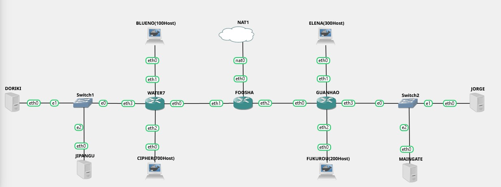
<br>

Diberikan sebuah topologi seperti diatas yang mana kami diminta untuk menyelesaikannya dalam `Subnetting`. Dalam hal ini dengan metode `CIDR`.

`Keterangan` :     
1. Doriki adalah DNS Server
2. Jipangu adalah DHCP Server
3. Maingate dan Jorge adalah Web Server
4. Jumlah Host pada Blueno adalah 100 host
5. Jumlah Host pada Cipher adalah 700 host
6. Jumlah Host pada Elena adalah 300 host
7. Jumlah Host pada Fukurou adalah 200 host

## Konfigurasi B
---

Selanjutnya kami melakukan pembagian subnetting seperti berikut:

1. Melakukan pembagian subnet terhadap topologi yang ada dengan Class A:
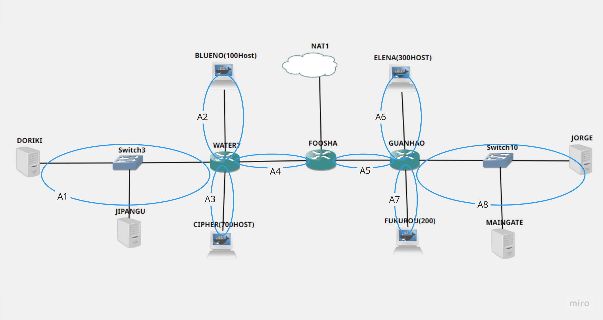
<br>

2. Melakukan pembagian subnet terhadap topologi yang ada dengan Class B:
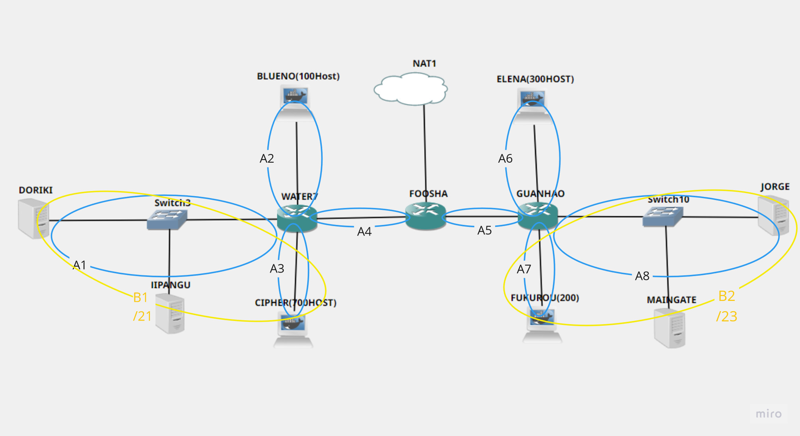
<br>
  
3. Melakukan pembagian subnet terhadap topologi yang ada dengan Class C:
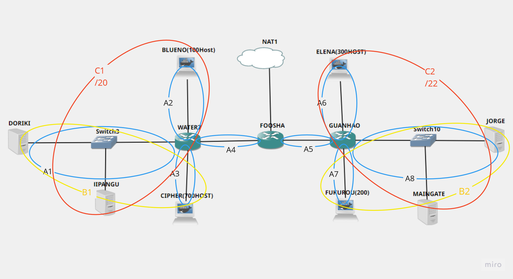
<br>
  
4. Melakukan pembagian subnet terhadap topologi yang ada dengan Class D:
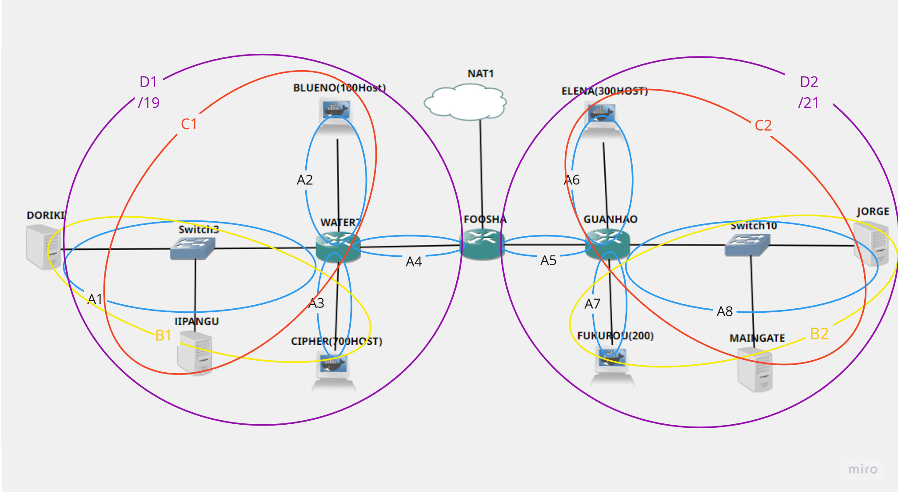
<br>
  
5. Melakukan pembagian subnet terhadap topologi yang ada dengan Class E:
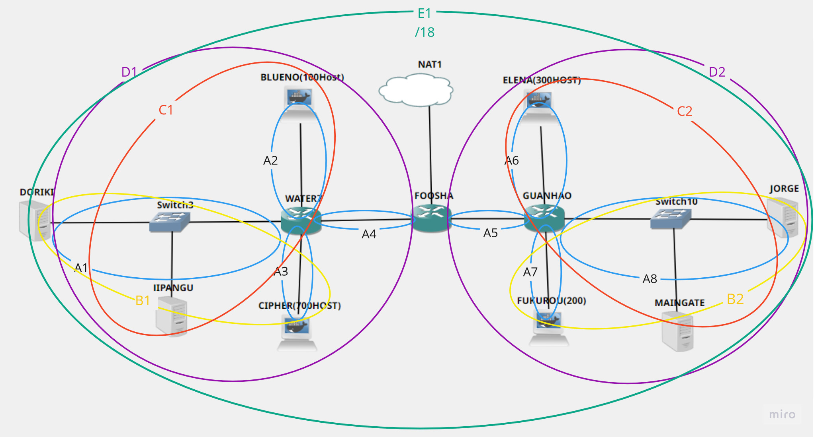
<br>
  
### Kemudian kami melakukan pembagian IP dan Tree seperti berikut:
---
1. Pertama-tama dari pembagian subnet Class A kami menghitung penggunaan IP sehingga didapatkan pembagiannya sebagai berikut:
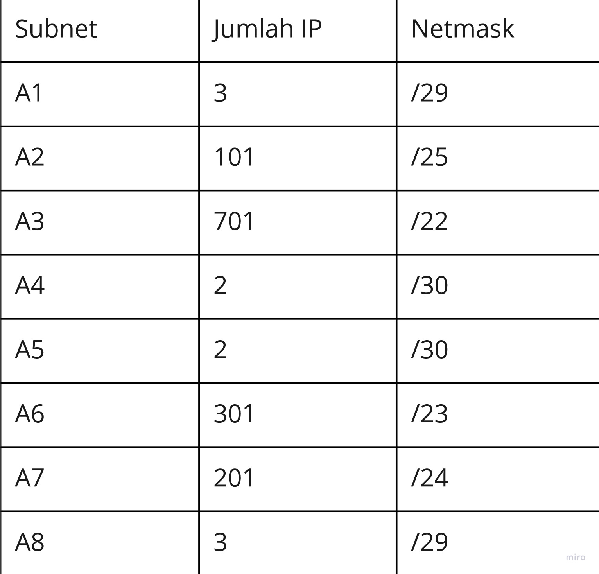
<br>

2. Selanjutnya kami mendetilkan pembagian IP berdasarkan hasil dari pembagian subnetting kelas B, C, D, dan E sebagai berikut:
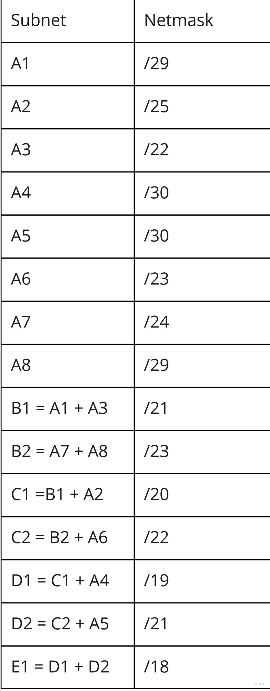
<br>

3. Lalu kami membuat tree berdasarkan pembagian subnetting dan Netmask metode CIDR guna mendapatkan NID yang spesifik dalam suatu subnett sebagai berikut:
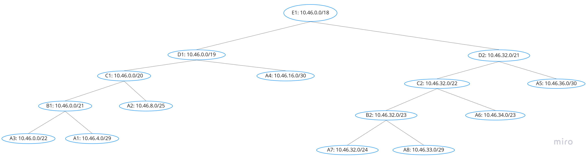
<br>

4. Setelah sudah maka didapatkan NID spesifik dalam suatu subnetting, maka kami menghitung broadcast address dan di tabelkan agar mudah dalam konfigurasi di GNS3 nantinya. Adapun tabel pembagian NID, Netmask, dan Broadcast Address sebagai berikut:
    - Contoh perhitungan mencari Broadcast dan Netmask dari sebuah NID:
    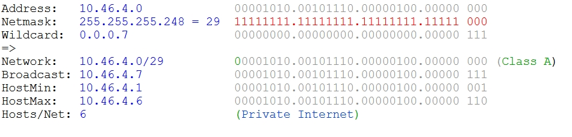
    - Tabel selengkapnya:
    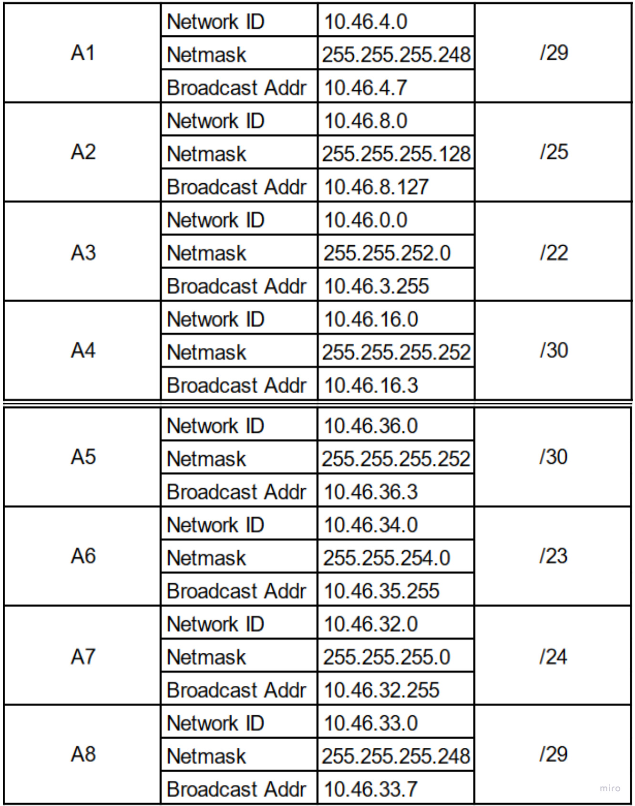


### Lalu kami melakukan konfigurasi awal tepatnya pada `network configuration` di setiap node pada platform GNS3:
---

1. Pada node yang dijadikan Router sesuai dengan perhitungan `Subnetting` dengan metode `CIDR` maka kami mengkonfignya sebagai berikut:
    - Foosha sebagai berikut: \
      Pada awal ini kami menghubungkan router Foosha melalui `eth0` menuju `NAT` dengan `DHCP`. Ketika masuk di nomer 1 kami merubahnya menjadi `Static IP`
    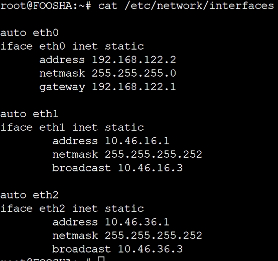
    - Water7 sebagai berikut:
    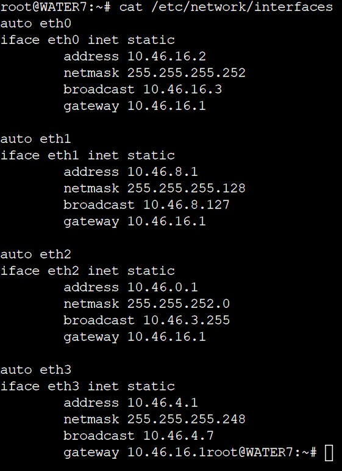
    - Guanhao sebagai berikut:
    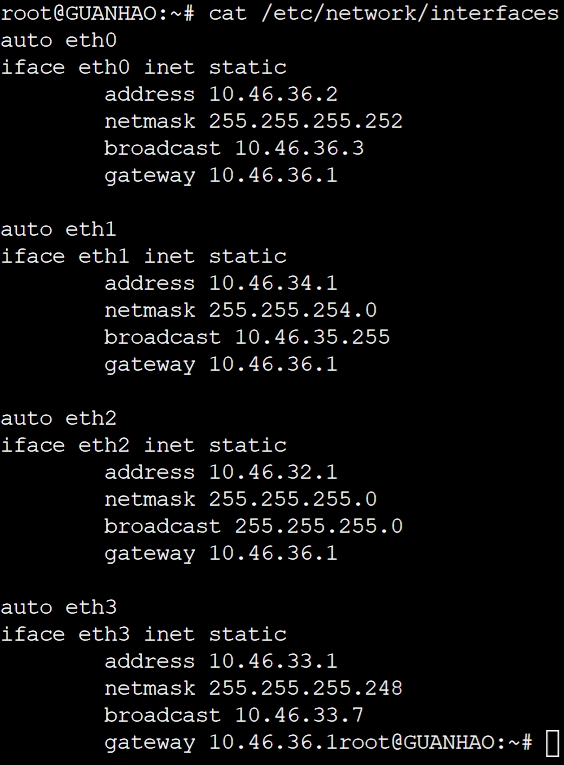

2. Pada `Doriki` **(DNS Server)** dan `Jipangu` **(DHCP Server)** kami konfigurasi sebagai berikut:
    - Doriki sebagai berikut:
    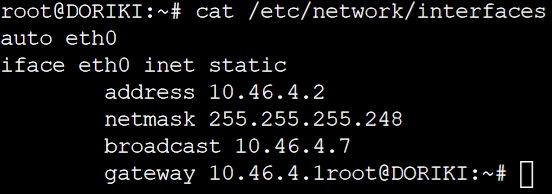
    - Jipangu sebagai berikut:
    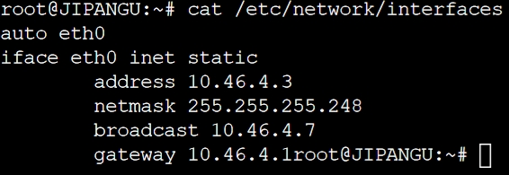

3. Pada `Client` kami konfigurasi sebagai berikut:
    - Blueno sebagai berikut:
    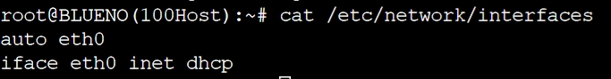
    - Cipher sebagai berikut:
    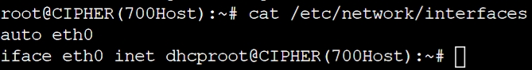
    - Elena sebagai berikut:
    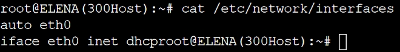
    - Fukurou sebagai berikut:
    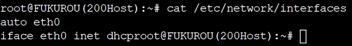

4. Pada `Web Server` kami konfigurasi sebagai berikut:
    - Jorge sebagai berikut:
    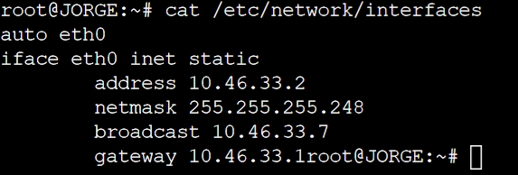
    - MainGate sebagai berikut:
    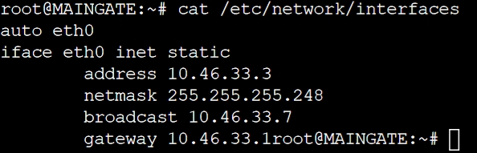

## Konfigurasi C
---

Lalu pada hal ini kami diminta untuk melakukan Routing agar setiap perangkat pada jaringan tersebut terhubung.

1. Routing pada `Router Foosha` sebagai berikut
    - terhadap Water7
    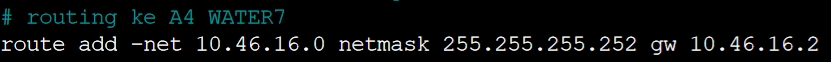
    - terhadap Blueno
    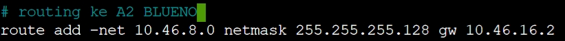
    - terhadap Cipher
    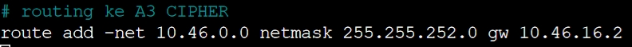
    - terhadap Doriki dan Jipangu
    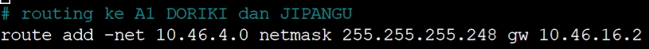
    - terhadap Guanhao
    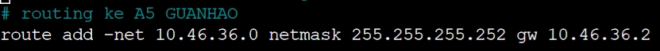
    - terhadap Elena
    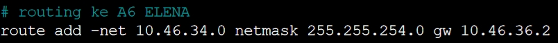
    - terhadap Fukurou
    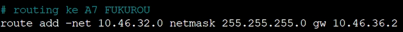
    - terhadap Jorge dan MainGate
    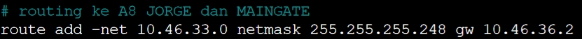

2. Routing pada `Router Water7` sebagai berikut
    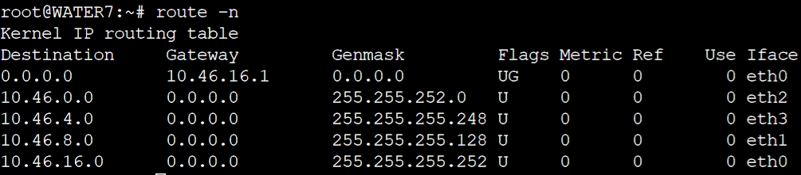

3. Routing pada `Router Guanhao` sebagai berikut
    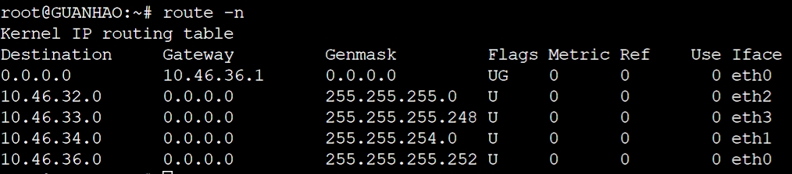

## Konfigurasi D
---

Kemudian kami di tugaskan memberikan IP kepada `Blueno`, `Cipher`, `Elena`, dan `Fukurou` secara dinamis menggunakan `DHCP`. Dimana kami menyelesaikan hal ini dengan meletakan `DHCP Server` pada **Jipangu** dan `DHCP Relay` pada `Router` **Foosha**, **Guanhao**, dan **Water7**.

1. Pertama kami melakukan konfigurasi `network interface` pada node-node tersebut **(Blueno, Cipher, Elena, dan Fukurou)** sesuai dengan pada point [Konfigurasi B](#konfigurasi-b)

2. Selanjutnya melakukan konfigurasi pada `DHCP Server` tepatnya di **Jipangu** sebagai berikut
    - Persiapan `DHCP Server` dengan mengunduh package yang dibutuh kan dan mendefinisikan `resolv.conf` menuju ke IP Private laptop kami agar terkoneksi ke Internet dan menspesifikasikan `interfaces` pengiriman dari IP yang akan di assigned melalui bantuan `DHCP Relay` nantinya. Adapun dokumentasinya sebagai berikut:
    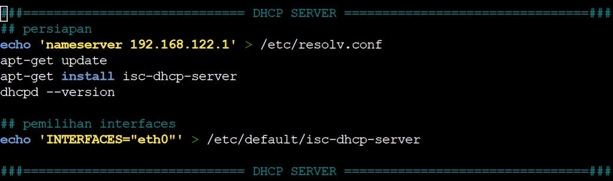

3. Lalu pembagian IP DHCP untuk `Client` **(Blueno, Cipher, Elena, dan Fukurou)** di **Jipangu** sebagai berikut
    - Deklarasi `subnet A1` yang mana hanya perlu dideklarasikan tetapi tidak harus memiliki settingan DHCP. 
    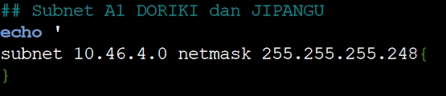
    - Selanjutnya pada `subnet A2` diberikan pengaturan sesuai dengan NID, netmask, range, broadcast address, dan dns server. Dimana range ini kami mengacu kepada penggunaan host dari Blueno yaitu `100` host. Kemudian untuk NID dan broadcast address menyesuaikan pada [tabel selengkapnya konfigurasi B](#konfigurasi-b)
    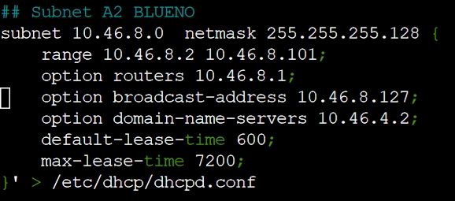
    - Selanjutnya pada `subnet A3` diberikan pengaturan sesuai dengan NID, netmask, range, broadcast address, dan dns server. Dimana range ini kami mengacu kepada penggunaan host dari Blueno yaitu `700` host. Kemudian untuk NID dan broadcast address menyesuaikan pada [tabel selengkapnya konfigurasi B](#konfigurasi-b)
    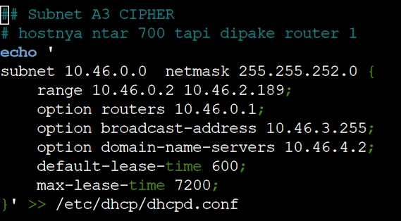
    - Selanjutnya pada `subnet A6` diberikan pengaturan sesuai dengan NID, netmask, range, broadcast address, dan dns server. Dimana range ini kami mengacu kepada penggunaan host dari Blueno yaitu `300` host. Kemudian untuk NID dan broadcast address menyesuaikan pada [tabel selengkapnya konfigurasi B](#konfigurasi-b)
    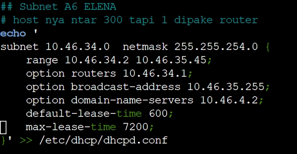
    - Selanjutnya pada `subnet A7` diberikan pengaturan sesuai dengan NID, netmask, range, broadcast address, dan dns server. Dimana range ini kami mengacu kepada penggunaan host dari Blueno yaitu `200` host. Kemudian untuk NID dan broadcast address menyesuaikan pada [tabel selengkapnya konfigurasi B](#konfigurasi-b)
    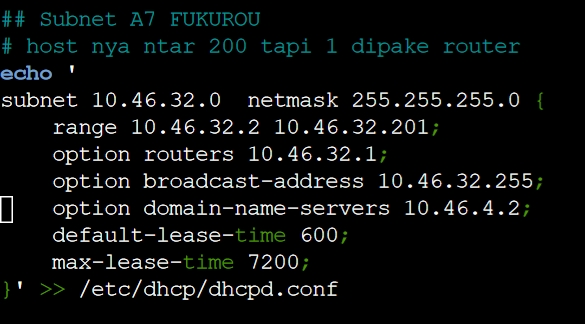

4. Agar `Client` **(Blueno, Cipher, Elena, dan Fukurou)** dengan `IP DHCP` dapat terhubung `koneksi ke internet`, maka dari itu diperlukan konfigurasi pada `DNS Server` yaitu **Forwarders Internet** sebagai berikut:\
Pertama kami mengunduh terlebih dahulu `bind9` agar dapat melakukan hal tersebut dan lakukan konfigurasinya pada file `named.conf.options`
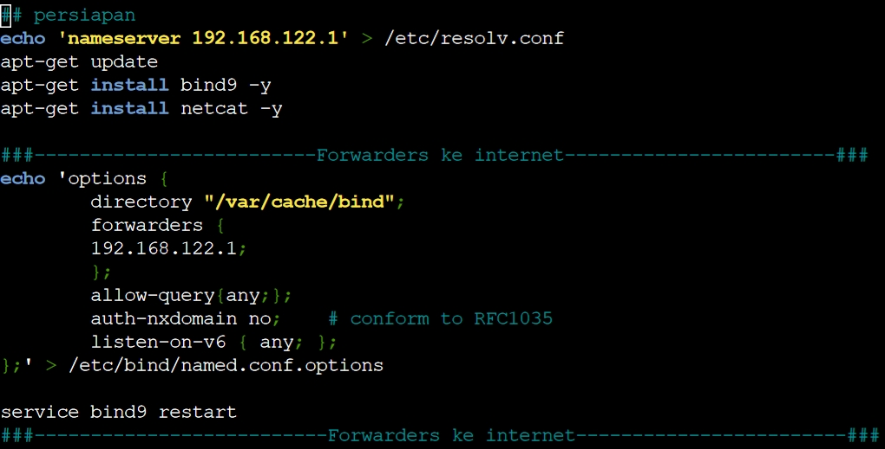

5. Selanjutnya untuk distribusi IP DHCP kepada `Client` **(Blueno, Cipher, Elena, dan Fukurou)** tersampaikan dari **Jipangu** atau `DHCP Server`, maka kita memerlukan pengaturan konfigurasi `DHCP Relay` pada `Router` **Water7** dan **Guanhao** seperti berikut:\
Pertama-tama kami mendefinisikan `resolv.conf` mengarah ke IP Private laptop agar tersambung ke internet, selanjutnya kami melakukan instalasi package `DHCP Relay` berupa `isc-dhcp-relay`, setelah sudah maka kami juga lakukan ip forwarding pada file `sysctl.conf` dan aktifkan nya, dan selanjutnya pada file `isc-dhcp-relay` kami mendefiniskan `DHCP Server` nya ada pada **Jipangu*** serta interfaces yang akan dilewatinya yaitu `eth0 eth1 eth2 eth3`. Ketika semua sudah maka lakukan restart dari `DHCP Relay` 
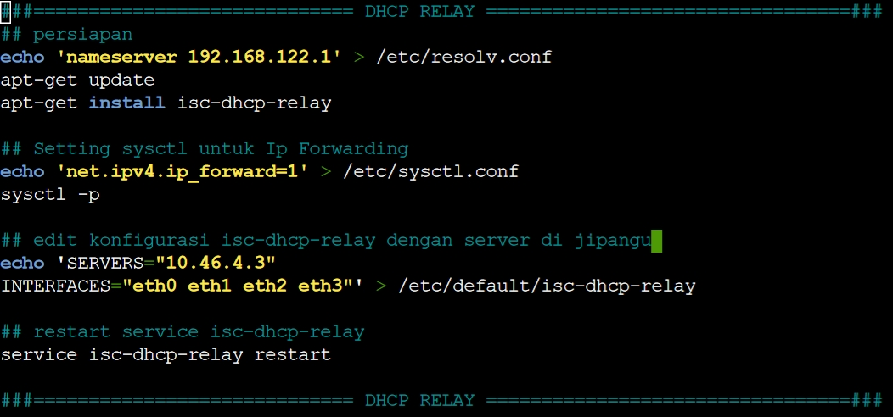


## Soal 1
---

Mengkonfigurasi `Router` **Foosha** dengan `iptables` dengan catatan tidak diperbolehkan **MASQUERADE**.

Dalam hal ini kami menyelesaikannya dengan menggunakan `ip static` pada `eth0` di `Foosha` 
```
auto eth0
iface eth0 inet static
      address 192.168.122.2
      netmask 255.255.255.0
      gateway 192.168.122.1
```
yang mana `gateway` ip nya kami dapatkan dari `resolv.conf` ketika menggunakan pengaturan `DHCP`.

Selanjutnya kami melakukan pengaturan `iptables` dengan `SNAT` dengan command sebagai berikut
```
iptables -t nat -A POSTROUTING -s 10.46.0.0/18 -o eth0 -j SNAT --to-source 192.168.122.2
```
dengan keterangan paramter IP pertama setelah -s yaitu `10.46.0.0/18` hal ini kami dapatkan dari `Tree CIDR` kami yang tertinggi yaitu mengenakan `Netmask 18` dan paramater IP `--to-source` kami gunakan `IP eth0 Foosha`.

Berikut dokumentasi pengerjaan nomer 1:
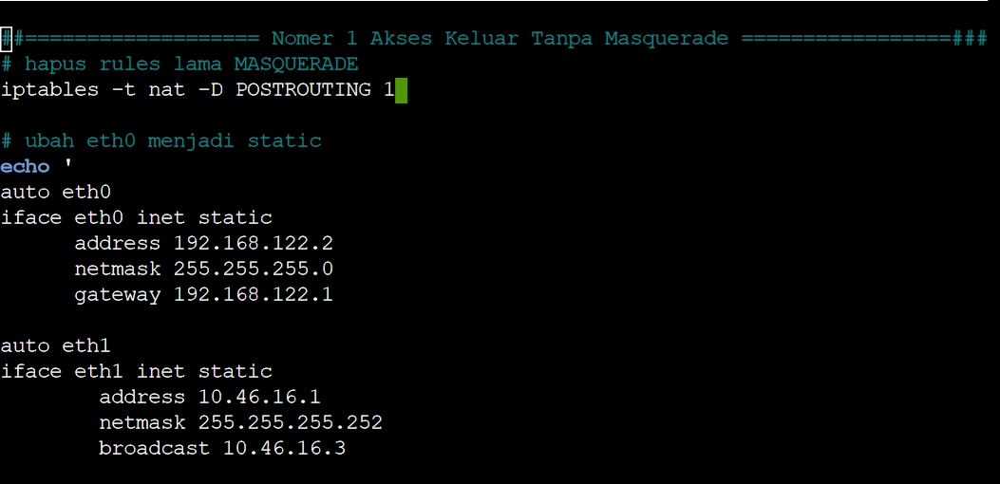
.jpg)

<br>

## Soal 2
---

Melakukan `Drop akses HTTP` dari luar Topologi dengan target `DHCP Server` dan `DNS Server`.

Dalam hal ini kami menyelesaikannya dengan command `iptables` sebagai berikut:
```
iptables -A FORWARD -d 10.46.4.0/29 -i eth0 -p tcp -m tcp --dport 80 -j DROP
```
dengan keterangan pada IP pertama `-d` merupakan IP NID untuk `subnet A1` dikarenakan terdapat `DHCP Server (Jipangu)` dan `DNS Server (Doriki)`